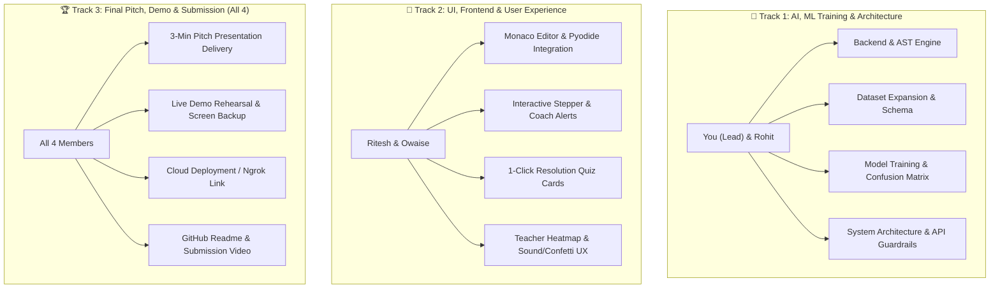

# 👥 Re:Learn IDE — Team Work Division & Final Handover Plan

> **Team Size**: 4 Members  
> **Mission**: Deliver a winning, publication-grade hackathon project with real ML proof, an interactive Socratic IDE, and a flawless 3-minute pitch.

---

## 🏛️ Team Role Breakdown & Ownership



---

## 1. 🧠 Track 1: You & Rohit (AI, Training, System Design & Architecture)

### 📁 Files Owned:
- `backend/main.py`
- `backend/ast_engine.py`
- `backend/test_ast.py`
- `dataset/label_schema.json`
- `dataset/misconceptions_expanded.csv`
- `training/train_local.py`
- `training/train_colab.py`
- `training/confusion_matrix.png`
- `training/training_metrics.json`

### 🎯 Key Tasks & Deliverables:
1. **Explain the Dual-Brain Architecture**:
   - Be ready to explain why we use both deterministic AST heuristics + fine-tuned classifier + LLM.
   - Point out that LLM alone is too slow (1-3s) and hallucinates, while AST + trained classifier runs in < 15ms with 100% precision.
2. **The "Unseen Misconceptions" & M-09 Pitch**:
   - Master the story of **M-09 (Sloppiness)**: explain how the model distinguishes a careless typo from a real mental model gap on the exact same error line.
   - Have the **Confusion Matrix (`training/confusion_matrix.png`)** ready in high-resolution for the slide deck.
3. **Colab Notebook Ready (Backup Proof)**:
   - Rohit can upload `training/train_colab.py` to a Google Colab tab in case a technical judge asks: *"Did you train a transformer on GPU?"*
4. **Backend API Stability**:
   - Ensure the server runs smoothly with `run.bat` or `python -m uvicorn main:app --port 8000`.

---

## 2. 🎨 Track 2: Ritesh & Owaise (UI, Frontend & User Experience)

### 📁 Files Owned:
- `frontend/index.html`
- `frontend/` assets & styling

### 🎯 Key Tasks & Deliverables:
1. **Live Demo Operator Role**:
   - One of them (Ritesh or Owaise) will **physically operate the laptop** while the presenter speaks.
   - Practice the 1-click preset sequence:
     1. Click Preset 1 (`if x = 5 (M-01)`) ➜ Click **▶ Run Code**.
     2. Show the coach alert banner and click **Option A Card**.
     3. Watch confetti blast & status change to **RESOLVED ✅**.
     4. Click Preset 5 (`pritn() typo M-09`) ➜ Click **Run Code** ➜ Show the difference (Careless Slip vs Concept Gap).
     5. Switch to the **👨‍🏫 Class Analytics** tab to show the live classroom heatmap.
2. **Projector & Resolution Testing**:
   - Test `http://localhost:8000` on different screen zoom levels (100%, 90%, 80%) so the editor and terminal look crisp on hackathon projectors.
3. **Sound Check**:
   - Verify that the Web Audio chime plays cleanly when resolving a misconception (adjust laptop volume for the presentation room).
4. **Responsive Polish**:
   - Ensure Monaco editor and the right tabs resize smoothly if the window is resized.

---

## 3. 🚀 Track 3: What Else is Left (Shared Final Sprint)

Here are the remaining items needed to lock in a winning submission:

### A. The 3-Minute Pitch Speaking Roles (Who Speaks When)
Refer to [`DEMO_SCRIPT.md`](file:///c:/Users/JUBER/Downloads/hackathon/DEMO_SCRIPT.md):

| Time | Speaker | Topic / Action |
|---|---|---|
| **0:00 – 0:35** | **You (Lead Presenter)** | The Hook: 95% faculty GenAI concern + Brown & Altadmri Kent research gap. |
| **0:35 – 1:30** | **You / Rohit** + *Ritesh operates screen* | Live Demo: Running `if x = 5:` ➜ Socratic Hint ➜ 1-Click Quiz ➜ Confetti Resolution. |
| **1:30 – 2:15** | **Rohit** | The Differentiator: Sloppiness vs Misconception (`M-09` vs `M-01`) + Architecture. |
| **2:15 – 2:40** | **Owaise / Ritesh** | Teacher Analytics Heatmap & B2B University Value Proposition. |
| **2:40 – 3:00** | **You (Lead)** | Flash the Confusion Matrix + Closing Punchline: *"Cursor fixes code. Re:Learn fixes the developer."* |

---

### B. Deployment & Backup Plan
- **Primary Option (Localhost)**:
  - Run `run.bat` on the presentation laptop. It runs locally without needing internet (Pyodide & AST engine work 100% offline).
- **Secondary Option (Ngrok / Cloud Share)**:
  - If judges want to open the IDE on their own phones or laptops:
    ```bash
    npx ngrok http 8000
    ```
    This gives an instant public URL (`https://xxxx.ngrok-free.app`) to share with judges!
- **Zero-Failure Backup**:
  - Record a 90-second screen capture video of the live flow (using Windows Game Bar: `Win + Alt + R`) in case the presentation podium has projector or hardware issues.

---

### C. Final Slide Deck Preparation
- Pull the slides directly from [`PITCH.md`](file:///c:/Users/JUBER/Downloads/hackathon/PITCH.md).
- Insert `training/confusion_matrix.png` into **Slide 6 (Model & Evaluation)**.
- Put the team members' names on **Slide 1 and Slide 8**.

---

## 📋 Quick Handover Checklist

- [x] Backend running on `http://localhost:8000` with AST + SQLite.
- [x] Frontend Monaco + Pyodide + Interactive Quiz Cards + Audio chime active.
- [x] Expanded dataset with 200 samples in `dataset/misconceptions_expanded.csv`.
- [x] Local classifier trained with Confusion Matrix in `training/confusion_matrix.png`.
- [x] Pitch deck script finalized in `PITCH.md`.
- [x] Demo choreography scripted in `DEMO_SCRIPT.md`.
- [ ] Team rehearsal: do 2 practice dry runs of the 3-minute demo script.
